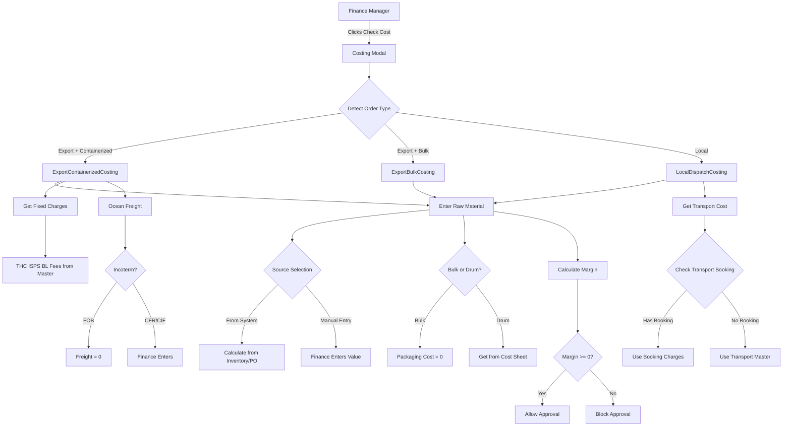
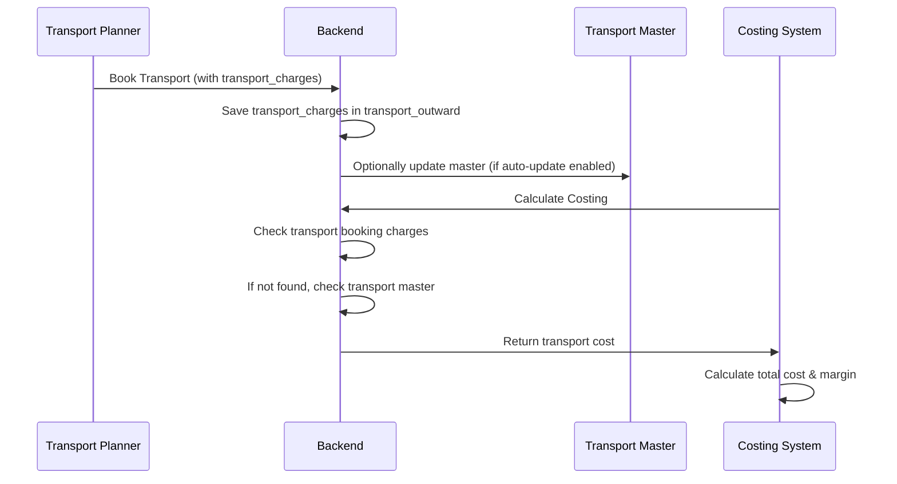

# Enhanced Costing & Margin Validation System - Implementation Plan

## Overview

This plan implements a comprehensive costing system that integrates transport booking charges, provides flexible raw material cost entry, and enforces margin validation before quotation approval.

## Architecture Flow



## Implementation Components

### 1. Transport Master Auto-Update System

**Backend Changes:**

**File: `backend/server.py`**

- Add endpoint to update transport master from booking charges
- Create function to calculate average/update transport route rates from actual bookings
- Add logic in transport booking endpoints to optionally update master

**New Endpoint:**

```python
@api_router.post("/transport/routes/update-from-bookings")
async def update_transport_master_from_bookings(
    route_id: Optional[str] = None,
    auto_update: bool = True,
    current_user: dict = Depends(get_current_user)
)
```

**Logic:**

- When transport is booked with `transport_charges`, optionally update corresponding route in `transport_routes`
- Calculate average rate from recent bookings for same route
- Only update if `auto_update` flag is enabled (admin control)

**File: `backend/costing_service.py`**

- Already implemented: Transport booking charges take priority over master
- No changes needed here

### 2. Enhanced Local Dispatch Costing Component

**File: `frontend/src/components/costing/LocalDispatchCosting.js`**

**Changes Required:**

1. **Add Raw Material Source Selection:**

   - Radio buttons: "From System" / "Enter Manually"
   - If "From System": Show calculated value (read-only initially, can override)
   - If "Enter Manually": Allow direct input
   - Add button "Calculate from System" when manual mode is active

2. **Add Bulk/Drum Selection:**

   - Radio buttons: "Bulk" / "Drum"
   - If Bulk selected: Set packaging_cost to 0, disable field
   - If Drum selected: Auto-fill from cost sheet, allow override
   - Show indicator: "Auto from cost sheet" or "Not applicable for bulk"

3. **Add EXW/Delivered Selection:**

   - Radio buttons: "EXW" / "Delivered"
   - Store selection in costing data (may affect display/calculation later)
   - Default based on quotation incoterm if available

4. **Enhance Transport Cost Display:**

   - Show source indicator: "From transport booking" or "From transport master"
   - Display transport route name if from master
   - Allow manual override

5. **Update State Management:**

   - Add fields: `raw_material_source`, `packaging_type`, `incoterm_type`
   - Update `handleChange` to handle new fields
   - Pass all fields to `onUpdate` callback

### 3. Enhanced Export Containerized Costing Component

**File: `frontend/src/components/costing/ExportContainerizedCosting.js`**

**Changes Required:**

1. **Add Raw Material Source Selection:**

   - Same as LocalDispatchCosting (From System / Enter Manually)

2. **Add Bulk/Drum Selection:**

   - Radio buttons: "Bulk" / "Drum"
   - If Bulk: Set packaging_cost to 0
   - If Drum: Auto from cost sheet

3. **Add EXW/Delivered Selection:**

   - Radio buttons: "EXW" / "Delivered"
   - Store in costing data

4. **Enhance Ocean Freight Section:**

   - Add DG/Non-DG radio buttons (already exists, ensure it's working)
   - Show clear indication when freight is required (CFR/CIF) vs not (FOB)
   - Add helper text explaining incoterm implications

5. **Fixed Charges Display:**

   - Ensure all fixed charges show "Auto from master × N containers"
   - Make them read-only (already implemented)

### 4. Enhanced Export Bulk Costing Component

**File: `frontend/src/components/costing/ExportBulkCosting.js`**

**Changes Required:**

1. **Add Raw Material Source Selection:**

   - Radio buttons: "From System" / "Enter Manually"
   - Same logic as other components

2. **Ocean Freight Logic:**

   - Ensure FOB = 0, CFR/CIF = manual entry
   - Add clear labels

### 5. Backend Costing Calculation Updates

**File: `backend/costing_service.py`**

**Changes Required:**

1. **Update `calculate_local_dispatch_cost`:**

   - Accept `raw_material_source` parameter ("SYSTEM" or "MANUAL")
   - Accept `packaging_type` parameter ("BULK" or "DRUM")
   - Accept `incoterm_type` parameter ("EXW" or "DELIVERED")
   - If packaging_type is "BULK", force packaging_cost to 0
   - If raw_material_source is "MANUAL", skip system calculation

2. **Update `calculate_export_containerized_cost`:**

   - Same parameters as above
   - Add `is_dg` parameter handling (already exists, ensure it affects THC)

3. **Update `calculate_export_bulk_cost`:**

   - Add `raw_material_source` parameter
   - Ensure ocean freight logic respects incoterm

**File: `backend/server.py`**

**Endpoint: `/api/costing/calculate`**

- Accept new parameters: `raw_material_source`, `packaging_type`, `incoterm_type`
- Pass these to costing service methods
- Store in costing calculation record

**Endpoint: `/api/costing/{costing_id}` (PUT)**

- Accept updates to new fields
- Validate packaging_type affects packaging_cost correctly

### 6. Costing Data Model Updates

**File: `backend/server.py`**

**Update `CostingCalculationCreate` model:**

```python
The image attached is from job order page, remove the arabic from that label. Instead keep a small tab at the top, English and arabic. upon clicking arabic, i need to see arabic label as wellraw_material_source: Optional[str] = "SYSTEM"  # "SYSTEM" or "MANUAL"
packaging_type: Optional[str] = None  # "BULK" or "DRUM"
incoterm_type: Optional[str] = None  # "EXW" or "DELIVERED"
```

**Update `CostingCalculation` model:**

- Include same fields

### 7. Approval Flow Enhancement

**File: `frontend/src/pages/FinanceApprovalPage.js`**

**Changes Required:**

1. **Negative Margin Blocking:**

   - Already implemented: Button disabled if negative margin
   - Ensure error message is clear

2. **Rejection Flow:**

   - When rejecting, require rejection reason
   - Save `rejection_reason` in quotation
   - Show rejection reason to PFI creator
   - Update quotation status to "rejected"

**File: `backend/server.py`**

**Endpoint: `/api/quotations/{quotation_id}/approve`**

- Already checks for `cost_confirmed`
- Already checks for negative margin
- No changes needed

**Endpoint: `/api/quotations/{quotation_id}/reject`**

- Ensure it accepts and saves `rejection_reason`
- Update quotation status
- Create notification for PFI creator

### 8. UI/UX Improvements

**File: `frontend/src/components/CostingModal.js`**

**Changes Required:**

1. **Initial Calculation:**

   - When "Calculate Cost" is clicked, show loading state
   - After calculation, pre-fill all auto-calculated values
   - Show source indicators for each cost component

2. **Save vs Confirm:**

   - "Save Changes": Saves without confirming (allows edits)
   - "Confirm Cost": Final confirmation, locks costing
   - Only show "Confirm Cost" if all required fields filled

3. **Validation Messages:**

   - Show warnings if required fields missing
   - Highlight negative margin prominently
   - Show calculation source for each component

### 9. Transport Master Management

**New File: `frontend/src/pages/TransportMasterPage.js` (Optional - Admin Page)**

**Features:**

- View all transport routes
- Pre-feed routes (RAK → Jebel Ali, RAK → Amriya, etc.)
- See auto-updated rates from bookings
- Manual override capability
- Enable/disable auto-update per route

**Or integrate into existing Settings page:**

- Add "Transport Routes" section
- Allow admin to manage routes

### 10. Data Flow Integration

**Transport Booking → Costing Flow:**



## Implementation Order

1. **Phase 1: Backend Data Model & Logic**

   - Update CostingCalculation models
   - Update costing service methods
   - Add transport master update logic
   - Test backend calculations

2. **Phase 2: Local Dispatch Costing UI**

   - Add Bulk/Drum selection
   - Add Raw Material source selection
   - Add EXW/Delivered selection
   - Enhance transport cost display
   - Test with real data

3. **Phase 3: Export Costing UI**

   - Update ExportContainerizedCosting
   - Update ExportBulkCosting
   - Ensure DG/Non-DG works correctly
   - Test all incoterm scenarios

4. **Phase 4: Approval Flow**

   - Enhance rejection flow with reasons
   - Ensure negative margin blocking works
   - Test approval/rejection scenarios

5. **Phase 5: Transport Master Management**

   - Create admin interface (or add to Settings)
   - Test auto-update functionality
   - Pre-feed common routes

## Testing Checklist

- [ ] Local dispatch costing with bulk selection
- [ ] Local dispatch costing with drum selection
- [ ] Raw material cost from system calculation
- [ ] Raw material cost manual entry
- [ ] Transport cost from booking charges
- [ ] Transport cost from master (fallback)
- [ ] Export containerized with all incoterms
- [ ] Export bulk with all incoterms
- [ ] DG vs Non-DG affects THC
- [ ] Negative margin blocks approval
- [ ] Rejection saves reason and notifies creator
- [ ] Transport master auto-update (if enabled)

## Files to Modify

**Backend:**

- `backend/server.py` - Models, endpoints, transport master update
- `backend/costing_service.py` - Calculation logic updates

**Frontend:**

- `frontend/src/components/costing/LocalDispatchCosting.js` - Major UI enhancements
- `frontend/src/components/costing/ExportContainerizedCosting.js` - UI enhancements
- `frontend/src/components/costing/ExportBulkCosting.js` - UI enhancements
- `frontend/src/components/CostingModal.js` - Modal improvements
- `frontend/src/pages/FinanceApprovalPage.js` - Rejection flow enhancement

**Optional (Admin):**

- `frontend/src/pages/SettingsPage.js` - Add transport r