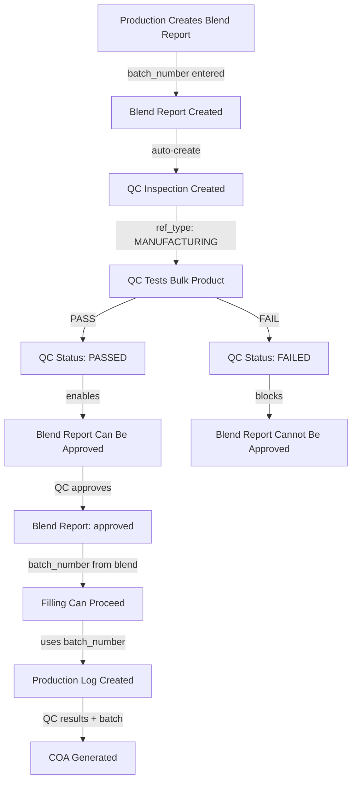

# QC Before Filling for Manufacturing Products

## Overview

For manufacturing products (like ETAC), QC inspection must happen after blending but before filling. This ensures bulk product quality is verified before packaging, and batch numbers flow correctly from blend → QC → filling → COA.

## Current Workflow vs Target Workflow

### Current (Trading Products):

```
Purchase → Security Inward (batch entered) → QC Inspection → COA → Filling
```

### Current (Manufacturing - Missing QC):

```
Blend Report (batch entered) → [QC Missing] → Filling (batch entered again)
```

### Target (Manufacturing):

```
Blend Report (batch entered) → QC Inspection → Blend Approved → Filling (uses batch from blend) → COA
```

## Implementation Plan

### 1. Backend: Extend QC Inspection Model

**File:** `backend/server.py`

- Extend `QCInspectionCreate` model to support `ref_type='MANUFACTURING'`
- Add `blend_report_id` field to link QC inspection to blend report
- Update QC inspection creation logic to handle manufacturing type

**Changes:**

- Line ~24346: Add `blend_report_id: Optional[str] = None `to `QCInspectionCreate`
- Line ~25271: Update `create_qc_inspection_new` to handle MANUFACTURING ref_type

### 2. Backend: Auto-Create QC Inspection on Blend Report Creation

**File:** `backend/server.py`

**Location:** `create_blend_report` function (line ~12015)

**Action:** After blend report is created, automatically create a QC inspection:

- `ref_type = 'MANUFACTURING'`
- `ref_id = blend_report.id`
- `ref_number = blend_report.report_number`
- `blend_report_id = blend_report.id`
- `batch_number = blend_report.batch_number` (pre-filled)
- `product_id` and `product_name` from job order
- `status = 'PENDING'`
- Link job order to QC inspection

**Implementation:**

```python
# After blend report creation (line ~12033)
# Create QC inspection for manufacturing
qc_inspection = {
    "id": str(uuid.uuid4()),
    "qc_number": await generate_sequence("QC", "qc_inspections"),
    "ref_type": "MANUFACTURING",
    "ref_id": report.id,
    "ref_number": report_number,
    "blend_report_id": report.id,
    "job_order_id": data.job_order_id,
    "product_id": job["product_id"],
    "product_name": job["product_name"],
    "batch_number": data.batch_number,
    "status": "PENDING",
    "created_at": datetime.now(timezone.utc).isoformat()
}
await db.qc_inspections.insert_one(qc_inspection)
```

### 3. Backend: Require QC Pass for Blend Report Approval

**File:** `backend/server.py`

**Location:** `approve_blend_report` function (line ~12061)

**Action:** Before approving blend report, check if linked QC inspection exists and is PASSED:

- Find QC inspection by `blend_report_id`
- If no QC inspection exists, raise error
- If QC inspection status is not 'PASSED', raise error
- Only allow approval if QC is PASSED

**Implementation:**

```python
# Before approval (line ~12066)
qc_inspection = await db.qc_inspections.find_one(
    {"blend_report_id": report_id}, {"_id": 0}
)
if not qc_inspection:
    raise HTTPException(status_code=400, detail="QC inspection not found. Please complete QC inspection first.")
if qc_inspection.get("status") != "PASSED":
    raise HTTPException(status_code=400, detail=f"QC inspection must be PASSED before approving blend report. Current status: {qc_inspection.get('status')}")
```

### 4. Backend: Update QC Pass Logic for Manufacturing

**File:** `backend/server.py`

**Location:** `pass_qc_inspection` function (line ~25340)

**Action:** When QC inspection is passed for MANUFACTURING type:

- Update blend report status to allow approval (don't auto-approve, just mark QC as passed)
- Don't create GRN/DO (those are for INWARD/OUTWARD)
- Optionally update job order with QC status

### 5. Frontend: Blend Reports Page - Show QC Status

**File:** `frontend/src/pages/BlendReportsPage.js`

**Changes:**

- Add QC status column to blend reports table
- Show link/button to open QC inspection if exists
- Disable "Approve" button if QC is not passed
- Show badge indicating QC status (Pending/Passed/Failed)

**Implementation:**

- Fetch QC inspections when loading blend reports
- Match by `blend_report_id` or `ref_id`
- Display QC status in table
- Add "View QC" button that opens QC inspection modal

### 6. Frontend: QC Inspection Page - Show Manufacturing Inspections

**File:** `frontend/src/pages/QCInspectionPage.js`

**Changes:**

- Update `loadData` to fetch manufacturing QC inspections
- Filter inspections by `ref_type='MANUFACTURING'`
- Show blend report reference in inspection list
- Display batch number from blend report
- Update inspection modal to show blend report details

**Implementation:**

- Modify API call to include `ref_type=MANUFACTURING`
- Add blend report number to inspection display
- Show "Blend Report: BLR-XXXX" in inspection details

### 7. Frontend: Production Schedule - Check Blend Approval Before Filling

**File:** `frontend/src/pages/ProductionSchedulePage.js`

**Changes:**

- When creating production log (filling), check if blend report exists and is approved
- For manufacturing products, require blend report approval before filling
- Auto-populate batch number from approved blend report
- Show warning if trying to fill without approved blend

**Implementation:**

- In `handleCreateLog` function, check job order for blend report
- If blend report exists, verify it's approved
- Pre-fill batch number from blend report
- Disable filling if blend not approved

### 8. Backend: Filling Validation

**File:** `backend/server.py`

**Location:** Production log creation endpoint (around line ~11800)

**Action:** For manufacturing products, validate blend report approval:

- Check if job order has blend report
- Verify blend report status is 'approved'
- Verify QC inspection is PASSED
- Use batch number from blend report (don't allow different batch)

### 9. COA Generation - Use Manufacturing QC Results

**File:** `backend/server.py`

**Location:** COA generation functions (around line ~25524)

**Action:** Ensure COA can be generated from manufacturing QC inspections:

- COA generation should work for both OUTWARD and MANUFACTURING ref_types
- Include batch number from QC inspection (which came from blend report)
- Use test results from QC inspection

### 10. API Updates

**File:** `frontend/src/lib/api.js`

**Changes:**

- Add method to get QC inspection by blend report ID
- Add method to link blend report to QC inspection

## Data Flow Diagram



## Testing Checklist

1. Create blend report → Verify QC inspection auto-created
2. Try to approve blend without QC pass → Should fail
3. Pass QC inspection → Verify blend can be approved
4. Try to fill without approved blend → Should be blocked
5. Fill with approved blend → Verify batch number matches
6. Generate COA → Verify batch number and QC results included

## Migration Notes

- Existing blend reports without QC inspections: Allow manual QC creation
- Existing approved blend reports: May need retroactive QC inspection creation
- Consider adding migration script for existing data